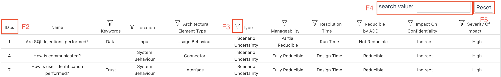
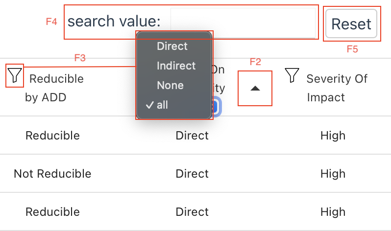
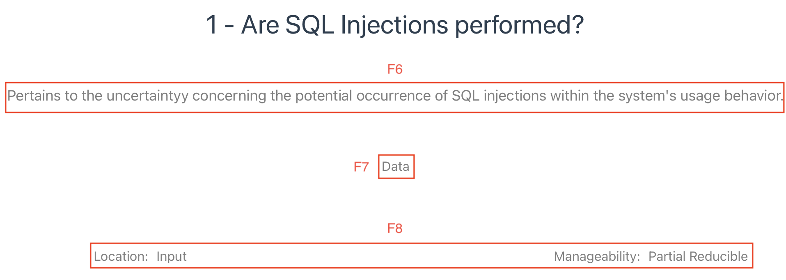
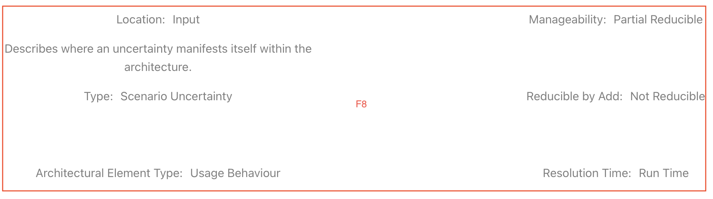
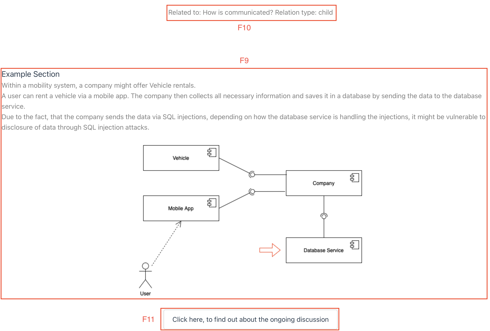
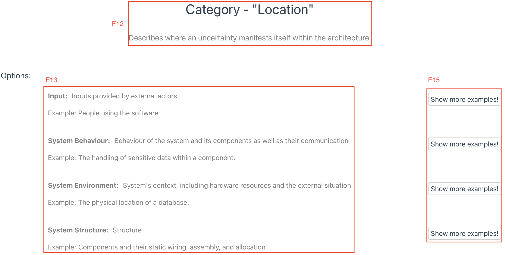
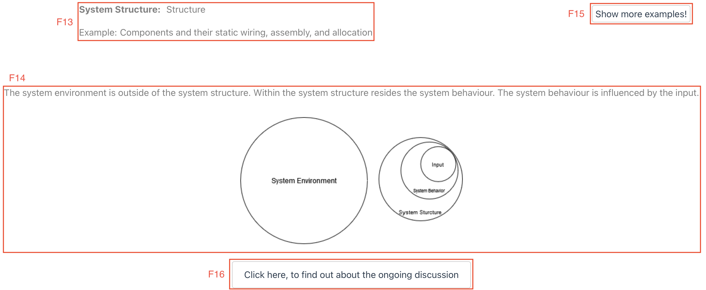

# Overview

This repository includes a prototype for collecting uncertainties in software designs.

It allows a comprehensive overview of known uncertainties that can impact data confidentiality.
Additionally, software architects can collaborate on the knowledge through GitHub issues, which can be accessed from within the tool.

To access the tool use the following link:
https://abunai-dev.github.io/UncertaintySourceArchive/

# Functions

Table View:
F2: Sort Table Ascending/Descending
F3: Filter Table by Multiple Properties
F4: Search for specific Uncertainty
F5: Reset Filters and Search

Uncertainty Detail View:
F6: Show Definition
F7: Show Keywords
F8: Show Classification Properties
F9: Show Example
F10: Show Related Uncertainties
F11: Link to Discussion on GitHub

Classification Detail View:
F12: Show Description
F13: Show Options
F14: Show Graphic Representation
F15: Filter Table by Option
F16: Link to Discussion on GitHub
Table 5.1: Features included in prototype

